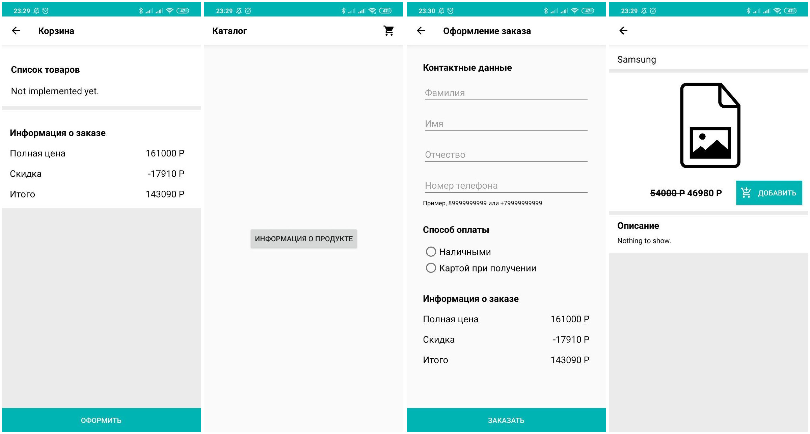

# Интернет-магазин

## Описание

Проект, реализуемый в рамках курса Android Development от компании Napoleon IT. Здесь будет лежать исходный код приложения.

## Внешний вид запущенного приложения



## Структура проекта

Помимо практики написания кода под платформу Android, курс рассчитан на то, чтобы слушатели старались применять практики чистого кода. 

Здесь представлена текущая структура пакетов, которая будет пересматриваться в ходе курса, а также описание их назначения. 

```bash
├── activity   (Логика работы экранов)
├── model      (Сущности предметной области, логика работы с БД и сетью)
├── presenter  (Прослойка между model и activity)
└── view       (Интерфейсы для activity)
```

Классы, интерфейсы и методы также будут пересматриваться в ходе курса.

## Требования / Задачи

* Обязательные экраны:
  * Каталог
  * Информация о продукте
  * Корзина
  * Оформление заказа
* Оформление заказа
  * Контактные данные клиента
  * Выбор способа оплаты
  * Информация о собранной корзине 
  * Валидация номера телефона
* Прочие требования:
  * На всех экранах кроме первого должна быть стрелка возврата назад
  * На каждом экране должен быть Header
  * При реализации экранов использовать Moxy.